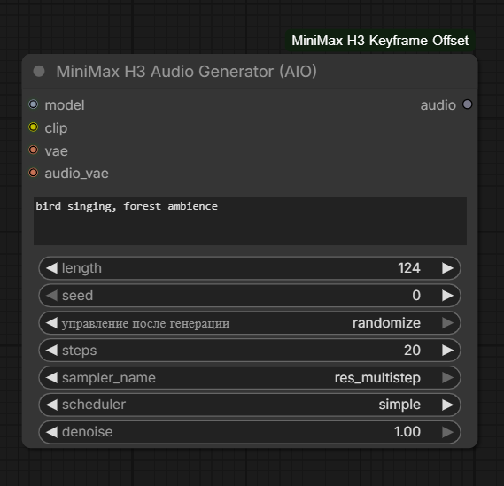

# ComfyUI MiniMax H3 Keyframe Offset

> **Advanced MiniMax H3 nodes for ComfyUI** — arbitrary keyframe frame offsets for Image-to-Video generation, plus an all-in-one text-to-audio generator. Unlock the full creative potential of MiniMax H3 beyond the stock node limitations.

<p align="center">
  <a href="LICENSE"></a>
  
  
  
</p>

---

## 📑 Table of Contents

- [Features](#-features)
- [Installation](#-installation)
- [Dependencies](#-dependencies)
- [Nodes Overview](#-nodes-overview)
  - [MiniMax H3 Keyframe Offset](#-minimax-h3-keyframe-offset)
  - [MiniMax H3 Audio Generator (AIO)](#-minimax-h3-audio-generator-aio)
- [How the Core Patch Works](#-how-the-core-patch-works)
- [Quick Start](#-quick-start)
- [Technical Details](#-technical-details)
- [Troubleshooting](#-troubleshooting)
- [License](#-license)
- [Credits](#-credits)

---

## ✨ Features

- 🎬 **Arbitrary Keyframe Offsets** — place `first_frame` and `last_frame` at **any frame index** inside the video, not just at the start and end
- 🧩 **Drop-in Replacement** — fully compatible with the stock MiniMax H3 Image-to-Video conditioning pipeline
- 🔊 **All-in-One Audio Generation** — a single node that handles conditioning, noise, sampling, and decoding: text prompt → ready-to-save audio
- ⚙️ **Full Sampler Control** — 23 samplers and 9 schedulers exposed, with seed, steps, and denoise strength
- 🛡️ **Smart Clamping** — out-of-range offsets are automatically clamped with a console notification instead of crashing
- 🔧 **Non-invasive Core Patch** — a safe monkey-patch for ComfyUI's `PackedLayout` that gracefully degrades if the core changes
- 📦 **Zero External Dependencies** — uses only ComfyUI core libraries (`torch`, `comfy`)

---

## 🚀 Installation

### Method 1: Git Clone (Recommended)

```bash
cd ComfyUI/custom_nodes
git clone https://github.com/asirusasr-maker/ComfyUI-MiniMax-H3-Keyframe-Offset.git
```

Then restart ComfyUI.

### Method 2: ComfyUI Manager

1. Open ComfyUI → **Manager** → **Install Custom Nodes**
2. Search for `MiniMax H3 Keyframe Offset`, or click **Install via Git URL** and paste:

```
https://github.com/asirusasr-maker/ComfyUI-MiniMax-H3-Keyframe-Offset
```

3. Restart ComfyUI

### Method 3: Manual (ZIP)

1. Download the repository as ZIP (**Code → Download ZIP**)
2. Extract into `ComfyUI/custom_nodes/ComfyUI-MiniMax-H3-Keyframe-Offset`
3. Restart ComfyUI

---

## 📦 Dependencies

This pack has **no external Python dependencies** beyond ComfyUI core. The included `requirements.txt` is intentionally empty:

```text
# No external dependencies beyond ComfyUI core (torch, comfy)
```

You may still run the standard command — it will simply do nothing:

**Portable ComfyUI (Windows):**

```bash
..\..\python_embeded\python.exe -m pip install -r requirements.txt
```

**Standard ComfyUI (Linux / venv):**

```bash
pip install -r requirements.txt
```

| Requirement | Notes |
|---|---|
| ComfyUI | Recent version with native **MiniMax H3** support (`comfy.ldm.minimax`) |
| `torch` | Already bundled with ComfyUI |
| MiniMax H3 checkpoints | Model, CLIP, VAE, and Audio VAE files for MiniMax H3 |

> ⚠️ **Important:** the Keyframe Offset node relies on ComfyUI's internal MiniMax implementation (`comfy.ldm.minimax.model.PackedLayout`). If your ComfyUI is too old to include MiniMax H3 support, update ComfyUI first.

---

## 🧩 Nodes Overview

Category in the node menu: **`model/conditioning/minimax`**

---

### 🎬 MiniMax H3 Keyframe Offset

Drop-in replacement for the stock **MiniMax H3 Image to Video** conditioning node that lets you inject keyframes at **arbitrary frame indices** instead of being locked to the very first and very last frames.

This gives the model far more freedom to generate natural motion *between* keyframes — e.g. place the first frame at index `20` and the last frame at index `100` inside a 124-frame clip, and let H3 hallucinate the intro and outro on its own.


**Inputs:**

| Name | Type | Default | Description |
|---|---|---|---|
| `clip` | CLIP | — | MiniMax H3 text encoder |
| `vae` | VAE | — | MiniMax H3 video VAE (encodes keyframe images) |
| `prompt` | STRING | — | Multiline text prompt (supports dynamic prompts) |
| `width` | INT | `1344` | Video width (step 32) |
| `height` | INT | `768` | Video height (step 32) |
| `length` | INT | `124` | Frame count @ 24 fps, snapped to the model's `17k+5` grid (124 ≈ 5 s; trained range ~124–362) |
| `first_frame_offset` | INT | `0` | Frame index where `first_frame` is injected. `0` = very first frame. Clamped to `[0, frame_count-1]` |
| `last_frame_offset` | INT | `-1` | Frame index where `last_frame` is injected. `-1` = last frame. Clamped to `[0, frame_count-1]` |
| `first_frame` | IMAGE | *(optional)* | Keyframe image for the start position |
| `last_frame` | IMAGE | *(optional)* | Keyframe image for the end position |

**Outputs:**

| Name | Type | Description |
|---|---|---|
| `positive` | CONDITIONING | Conditioning with `minimax_keyframes` + `minimax_frame_count` metadata |
| `latent` | LATENT | Empty audio-video latent (NestedTensor) ready for the sampler |

**Behavior notes:**

- Both offsets are **clamped** into the valid range; when clamping occurs, a message is printed to the console.
- `last_frame_offset = -1` automatically resolves to the final frame.
- Keyframe images are resized to the target resolution (`first_frame`: exact, `last_frame`: center-crop) and encoded through the VAE.
- Works with one keyframe, both keyframes, or none (pure text-to-video conditioning).

---

### 🔊 MiniMax H3 Audio Generator (AIO)

**All-in-one text-to-audio node.** One node replaces the entire chain: conditioning → noise → sampling → audio VAE decode. Type a description of the sound, and get a ready-to-save ComfyUI `AUDIO` output.



**Inputs:**

| Name | Type | Default | Description |
|---|---|---|---|
| `model` | MODEL | — | MiniMax H3 diffusion model |
| `clip` | CLIP | — | MiniMax H3 text encoder |
| `vae` | VAE | — | MiniMax H3 video VAE |
| `audio_vae` | VAE | — | MiniMax H3 **audio** VAE (decodes the audio latent) |
| `prompt` | STRING | `"bird singing, forest ambience"` | Text description of the desired sound |
| `length` | INT | `124` | Duration in frames @ 24 fps (124 ≈ 5 s) |
| `seed` | INT | `0` | Random seed (full 64-bit range) |
| `steps` | INT | `20` | Sampling steps |
| `sampler_name` | COMBO | `res_multistep` | 23 samplers: `euler`, `heun`, `dpmpp_2m_sde`, `dpmpp_3m_sde`, `uni_pc`, `res_multistep`, … |
| `scheduler` | COMBO | `simple` | 9 schedulers: `normal`, `karras`, `exponential`, `sgm_uniform`, `simple`, `ddim_uniform`, `beta`, `linear_quadratic`, `kl_optimal` |
| `denoise` | FLOAT | `1.0` | Denoise strength. `1.0` = full generation; `< 1.0` truncates the sigma schedule; `0.0` decodes the empty latent directly |

**Outputs:**

| Name | Type | Description |
|---|---|---|
| `audio` | AUDIO | Generated waveform (ComfyUI AUDIO dict, 32 kHz) — connect to **Save Audio** / **Preview Audio** |

**Behavior notes:**

- **CFG is hardcoded to `1.0`** — native MiniMax H3 is guidance-distilled and does not use classifier-free guidance. No negative prompt is needed.
- Sampling runs through `comfy.sample.sample_custom` with manually computed sigmas, giving exact control over the schedule.
- Output audio is normalized to the standard `{"waveform": [B, C, L], "sample_rate": 32000}` format regardless of the VAE decode layout (`[B,C,L]` or `[B,L,C]`).

---

## 🔧 How the Core Patch Works

ComfyUI's native MiniMax H3 implementation validates keyframe positions inside `comfy.ldm.minimax.model.PackedLayout` and does not allow arbitrary frame indices out of the box. This pack applies a **safe, reversible monkey-patch** at import time:

1. The original `PackedLayout.__init__` is wrapped.
2. Real keyframe indices are saved, and `0` is temporarily substituted to pass the internal validation.
3. After initialization, the true indices are restored and `position_ids` for the conditioning segments are **recalculated** with the correct temporal positions (`text_len + FRAME_RESCALE × frame_index`).

The patch is defensive: if ComfyUI's internals change in the future, the patch fails with a **warning** in the console and the pack keeps loading (nodes fall back to stock behavior) instead of crashing your workflow:

```
MiniMax H3 Keyframe Offset: Patch not applied (<reason>)
```

No core files are modified on disk — the patch lives only in memory for the current session.

---

## ⚡ Quick Start

### Keyframe Offset (Image → Video)

1. Add the **MiniMax H3 Keyframe Offset** node
2. Connect **CLIP** and **VAE** from your MiniMax H3 loaders
3. Connect `first_frame` and `last_frame` images
4. Set `length = 124`, then experiment:
   - `first_frame_offset = 0`, `last_frame_offset = -1` → stock behavior
   - `first_frame_offset = 17`, `last_frame_offset = 107` → the model generates ~0.7 s of free motion before and after the keyframes
5. Feed `positive` + `latent` into **KSampler** (CFG 1.0 recommended) → **VAE Decode** → save video

### Audio Generator (Text → Audio)

1. Add the **MiniMax H3 Audio Generator (AIO)** node
2. Connect `model`, `clip`, `vae`, and `audio_vae`
3. Type your sound description: `"thunderstorm over the ocean, distant waves"`
4. Set `length = 124` (~5 s), `steps = 20`, sampler `res_multistep`, scheduler `simple`
5. Connect `audio` output to **Save Audio** / **Preview Audio**

**No other nodes needed!** One node generates complete audio from text.

---

## 🔬 Technical Details

| Parameter | Value |
|---|---|
| Video latent channels | 24 |
| Video spatial compression | 16× (`width/16`, `height/16`) |
| Frame grid | `17k + 5` (auto-snapped upward) |
| Base FPS | 24 |
| Audio latent | 32 channels × 2 × `audio_t` |
| Audio latent FPS | 40 |
| Audio sample rate | 32000 Hz |
| Latent container | `comfy.nested_tensor.NestedTensor` (video + audio) |

Frame-count alignment follows the model's training grid:

```
frame_count = smallest n ≥ length such that n % 17 == 5
video_latent_t = ((frame_count - 5) // 17) * 5 + 2
audio_t        = round((frame_count / 24) * 40)
```

---

## 🔧 Troubleshooting

| Problem | Cause | Solution |
|---|---|---|
| Node doesn't appear in menu | ComfyUI too old | Update ComfyUI — MiniMax H3 support required |
| `Patch not applied` warning | ComfyUI core changed `PackedLayout` | Node still loads; offsets may behave like stock. Open an issue with your ComfyUI version |
| Offsets clamped message | Offset ≥ frame_count | Normal — pick an index within `[0, frame_count-1]` |
| Length changed after run | Frame grid snapping | Normal — length snaps up to the `17k+5` grid |
| Audio is silent | Wrong `audio_vae` connected | Use the MiniMax H3 **audio** VAE, not the video VAE |
| `denoise = 0.0` returns noise | Expected behavior | Decodes the empty latent — useful for debugging the audio VAE |

---

## 📄 License

This project is licensed under the **Apache License 2.0** — see the [LICENSE](LICENSE) file for details.

```
Copyright 2026 asirusasr-maker

Licensed under the Apache License, Version 2.0 (the "License");
you may not use this file except in compliance with the License.
You may obtain a copy of the License at

    http://www.apache.org/licenses/LICENSE-2.0

Unless required by applicable law or agreed to in writing, software
distributed under the License is distributed on an "AS IS" BASIS,
WITHOUT WARRANTIES OR CONDITIONS OF ANY KIND, either express or implied.
See the License for the specific language governing permissions and
limitations under the License.
```

---

## 🙏 Credits

- Built for [ComfyUI](https://github.com/comfyanonymous/ComfyUI)
- Powered by the **MiniMax H3** audio-video model
- Author: [asirusasr-maker](https://github.com/asirusasr-maker)

---

*Last updated: August 2026*
