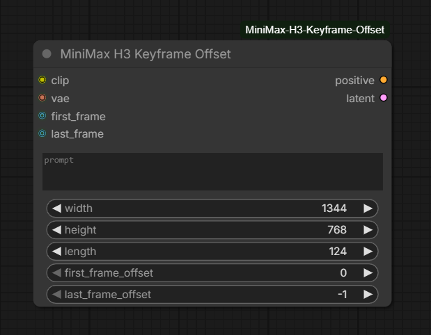
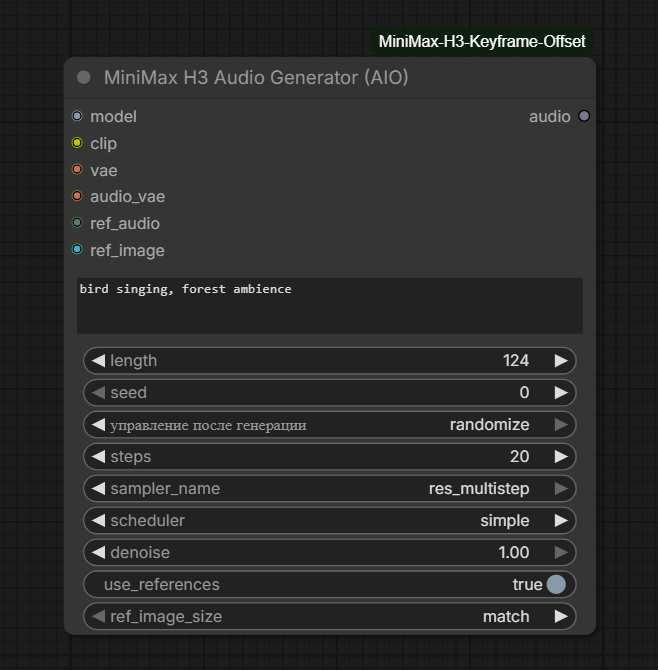

# ComfyUI-MiniMax-H3-Keyframe-Offset

[](https://github.com/comfyanonymous/ComfyUI)
[](https://www.python.org/downloads/)
[](LICENSE)

Custom nodes for **MiniMax H3** in ComfyUI:

- **Keyframe Offset** — place first/last keyframes at arbitrary frame indices instead of only at the start/end of the clip
- **Audio Generator (AIO)** — one-node text-to-audio pipeline with optional **voice cloning** and **visual reasoning** via Ref2VA references

---

## Table of Contents

- [Features](#features)
- [Installation](#installation)
- [Dependencies](#dependencies)
- [Nodes](#nodes)
  - [MiniMax H3 Keyframe Offset](#1-minimax-h3-keyframe-offset)
  - [MiniMax H3 Audio Generator (AIO)](#2-minimax-h3-audio-generator-aio)
- [Reference Workflows](#reference-workflows)
- [Technical Notes](#technical-notes)
- [Troubleshooting](#troubleshooting)
- [License](#license)
- [Credits](#credits)

---

## Features

| Feature | Description |
|---------|-------------|
| Arbitrary keyframe placement | Inject first/last frames at any index inside the clip, not only frame 0 / last frame |
| Safe offset clamping | Offsets are always clamped to `[0, frame_count-1]` based on the real (aligned) length |
| Works with external length | If `length` is wired from another node, clamping still uses the resolved frame count |
| Core restriction bypass | Runtime patch of `PackedLayout` so non-zero keyframe indices are accepted by ComfyUI core |
| All-in-one audio | Single node: prompt → noise → sample → Audio VAE decode → ComfyUI `AUDIO` |
| Native H3 sampling path | Uses `comfy.sample.sample_custom` with H3-friendly defaults (`cfg=1.0`, distilled model) |
| **Ref2VA voice cloning** | Feed `ref_audio` → model clones voice / style and generates new audio with it |
| **Visual audio reasoning** | Feed `ref_image` → model interprets the visual scene and adapts the sound accordingly (e.g. echo in mountains vs. narrow room) |

---

## Installation

### Method 1: Git clone (recommended)

```bash
cd ComfyUI/custom_nodes
git clone https://github.com/asirusasr-maker/ComfyUI-MiniMax-H3-Keyframe-Offset.git
```

Restart ComfyUI (or use **Reload Custom Nodes**).

### Method 2: Manual

1. Download this repository as ZIP
2. Extract into `ComfyUI/custom_nodes/ComfyUI-MiniMax-H3-Keyframe-Offset`
3. Restart ComfyUI

### Portable ComfyUI (Windows)

Same as above — put the folder under:

```
ComfyUI_windows_portable\ComfyUI\custom_nodes\ComfyUI-MiniMax-H3-Keyframe-Offset
```

---

## Dependencies

This pack uses **only ComfyUI core APIs** (`torch`, `comfy.*`, `node_helpers`).
There is **no extra pip package** required beyond a working MiniMax H3 setup in ComfyUI.

`requirements.txt` is intentionally empty of third-party packages:

```text
# No external dependencies beyond ComfyUI core (torch, comfy)
```

You still need the official MiniMax H3 models loaded in ComfyUI (diffusion model, CLIP/text encoder, video VAE, audio VAE).

---

## Nodes

Screenshots live in [`docs/images/`](docs/images/).

---

### 1. MiniMax H3 Keyframe Offset



Drop-in style conditioning node for MiniMax H3 image-to-video with **movable** first/last keyframes.

Stock H3 workflows typically pin:

- first keyframe → frame `0`
- last keyframe → last frame

This node lets you place each keyframe at **any index** inside the generated clip. The model can then generate motion before, between, and after the injected frames.

#### Inputs

| Name | Type | Description |
|------|------|-------------|
| `clip` | CLIP | MiniMax H3 CLIP / text encoder |
| `vae` | VAE | MiniMax H3 video VAE |
| `prompt` | STRING | Text prompt (supports dynamic prompts) |
| `width` | INT | Canvas width (default `1344`, step `32`) |
| `height` | INT | Canvas height (default `768`, step `32`) |
| `length` | INT | Requested frame count at 24 fps (snapped to H3 `17k+5` grid; default `124` ≈ 5s) |
| `first_frame_offset` | INT | Frame index for `first_frame` (`0` = start). Clamped to `[0, frame_count-1]` |
| `last_frame_offset` | INT | Frame index for `last_frame` (`-1` = last frame). Clamped to `[0, frame_count-1]` |
| `first_frame` | IMAGE (optional) | First keyframe image |
| `last_frame` | IMAGE (optional) | Last keyframe image |

#### Outputs

| Name | Type | Description |
|------|------|-------------|
| `positive` | CONDITIONING | Conditioning with `minimax_keyframes` + `minimax_frame_count` |
| `latent` | LATENT | Empty AV NestedTensor latent for sampling |

#### Behaviour details

1. `length` is aligned with `align_frame_count` (H3 temporal grid).
2. `last_frame_offset = -1` resolves to `frame_count - 1`.
3. Both offsets are clamped to `[0, frame_count - 1]`.
4. If clamping changes a value, a console message is printed, e.g.:

```text
[MiniMax H3 Keyframe Offset] Offsets clamped to [0, 123]: first_frame_offset 200->123, last_frame_offset 150->123
```

5. First frame is resized with crop mode `disabled` (stretch-to-canvas).
   Last frame uses `center` crop (aspect-preserving cover).
6. A load-time patch on `comfy.ldm.minimax.model.PackedLayout` allows non-zero resolved keyframe indices that core otherwise rejects.

#### Typical graph

```text
Load Image (first) ──┐
                     ├─► MiniMax H3 Keyframe Offset ─► KSampler / SamplerCustom ─► Decode
Load Image (last)  ──┘         ▲
                               │
                     CLIP + VAE + prompt + length
```

---

### 2. MiniMax H3 Audio Generator (AIO)



All-in-one **text → audio** node for MiniMax H3. No separate conditioning / sampler / decode nodes required.

Now with **Ref2VA-style references** — toggle `use_references` to unlock `ref_image` and `ref_audio` inputs for advanced control.

#### Inputs

| Name | Type | Description |
|------|------|-------------|
| `model` | MODEL | MiniMax H3 diffusion model |
| `clip` | CLIP | MiniMax H3 CLIP |
| `vae` | VAE | MiniMax H3 **video** VAE (needed for joint AV latent layout) |
| `audio_vae` | VAE | MiniMax H3 **audio** VAE (decode only) |
| `prompt` | STRING | Sound description. With refs enabled, refer to them as `<Picture 1>` and `<Audio 1>` |
| `length` | INT | Duration in frames at 24 fps (default `124` ≈ 5s; same 17k+5 grid) |
| `seed` | INT | Noise seed (`control after generate` / randomize supported) |
| `steps` | INT | Sampling steps (default `20`) |
| `sampler_name` | COMBO | Sampler (default `res_multistep`) |
| `scheduler` | COMBO | Scheduler (default `simple`) |
| `denoise` | FLOAT | Denoise strength `0.0–1.0` (default `1.0`) |
| `use_references` | BOOLEAN | **Enable Ref2VA** — exposes `ref_image` and `ref_audio` inputs |
| `ref_image_size` | COMBO | `match` (faster, scales to canvas) or `max` (2048 short edge, better identity) |
| `ref_image` | IMAGE (optional) | Visual anchor → `<Picture 1>`. Helps the model "reason" about the acoustic environment |
| `ref_audio` | AUDIO (optional) | Audio reference → `<Audio 1>`. Use for voice cloning or style transfer |

#### Outputs

| Name | Type | Description |
|------|------|-------------|
| `audio` | AUDIO | ComfyUI audio dict: `{"waveform": [B,C,L], "sample_rate": 32000}` |

#### Reference modes

When `use_references` is **ON**, the node builds native `minimax_refs` (same path as MiniMax H3 Reference to Video).

**Voice cloning** (`ref_audio`)
- Connect a short voice recording to `ref_audio`.
- Prompt: `A narrator reading a poem, calm and clear`
- The model clones the speaker's timbre and generates new speech in that voice.
- ⚠️ Native H3 prefers a `ref_image` together with `ref_audio`. Voice clone quality may drop without the visual anchor.

**Visual audio reasoning** (`ref_image`)
- Connect a photo to `ref_image`.
- Prompt: `echo reverberating through the valley`
- The model reads the scene (mountains, narrow room, cathedral, forest…) and adapts the reverb, atmosphere, and spatial character of the sound.
- Example: same prompt `echo` + photo of **mountains** → wide, distant echo; + photo of **small room** → tight, slap-back echo.

**Combined** (`ref_image` + `ref_audio`)
- Use both for maximum control: visual context + cloned voice / style.
- Prompt: `<Picture 1> A mysterious voice whispers ancient words, <Audio 1>`

#### Pipeline (internal)

1. Build empty AV NestedTensor latent (`320×320` video placeholder + audio latent at 40 Hz).
2. If `use_references` is on, encode `ref_image` (via video VAE) and/or `ref_audio` (via audio VAE) into native ref blocks.
3. Tokenize prompt (with `minimax_ref_items` when refs are active) and encode conditioning.
4. Build sampler object + sigmas from scheduler/steps.
5. `prepare_noise` + `comfy.sample.sample_custom`.
6. Take audio branch of NestedTensor → `audio_vae.decode`.
7. Normalize to ComfyUI `AUDIO` at **32 kHz stereo**.

#### CFG

Native MiniMax H3 is **guidance-distilled**. CFG is **hardcoded to `1.0`** and is not exposed in the UI.

#### Typical graph

**Basic (text only):**
```text
UNETLoader ──► model ─┐
CLIPLoader ─► clip  ─┤
VAELoader  ─► vae   ─┼─► MiniMax H3 Audio Generator (AIO) ─► Preview Audio / Save Audio
VAELoader  ─► audio_vae ─┘
```

**With references:**
```text
Load Image  ──► ref_image ──┐
Load Audio  ──► ref_audio ──┼─► MiniMax H3 Audio Generator (AIO) ─► Preview Audio
                             │
UNETLoader ──► model ────────┤
CLIPLoader ──► clip ─────────┤
VAELoader  ──► vae ──────────┤
VAELoader  ──► audio_vae ────┘
```

---

## Reference Workflows

### Voice clone

```text
prompt:  A news anchor delivering breaking headlines, professional tone
ref_audio:  5-second recording of the target speaker
ref_image:  (optional but recommended) portrait of the speaker or studio backdrop
```

### Environment-aware sound design

```text
prompt:  Heavy rainfall on a tin roof, distant thunder rolling
ref_image:  Photo of a rustic cabin interior
ref_audio:  (optional) short rain recording to match the texture
```

---

## Technical Notes

### Frame grid

MiniMax H3 video length follows the `17k + 5` rule. Requested `length` is snapped upward by `align_frame_count`.

Examples:

| Requested | Aligned `frame_count` | ~Duration @ 24 fps |
|-----------|----------------------|--------------------|
| 124 | 124 | ~5.2 s |
| 200 | 209 | ~8.7 s |
| 362 | 362 | ~15.1 s |

Audio latent rate is **40 Hz** (800 samples per latent frame at 32 kHz).

### PackedLayout patch

On import, the pack patches `PackedLayout.__init__` so keyframes with non-zero `resolved_frame_index` pass core validation, then restores the real indices and rewrites temporal `position_ids`. Without this patch, arbitrary offsets are rejected by stock ComfyUI MiniMax code paths.

### Audio output format

Always:

```python
{
  "waveform": FloatTensor[B, C, L],  # typically B=1, C=2 (stereo)
  "sample_rate": 32000
}
```

Compatible with native **Preview Audio** / **Save Audio** nodes.

### Reference image sizing

| Mode | Behaviour | Use when |
|------|-----------|----------|
| `match` | Scales relative to the generation canvas (320×320 internal placeholder) | Faster previews, rough style matching |
| `max` | Scales to 2048 px short edge, then crops to canvas multiple | Best identity preservation, higher VRAM |

---

## Troubleshooting

| Problem | Likely cause | Fix |
|---------|--------------|-----|
| `sample() got an unexpected keyword argument 'device'` | Old node calling `comfy.sample.sample` with custom kwargs | Update to current AIO node (`sample_custom`) |
| `too many indices for tensor of dimension 3` on Save/Preview Audio | Raw tensor returned instead of AUDIO dict | Update to current AIO (`_to_audio_dict`) |
| Seed UI does not change with randomize | Stale node instance after INPUT_TYPES change | Delete node from graph, restart ComfyUI, add node again |
| Offsets ignored / core error on non-zero index | Patch failed to apply | Check console for `MiniMax H3 Keyframe Offset: Patch applied successfully` |
| Offset larger than clip length | Expected | Value is clamped; see console clamp log |
| Empty / silent audio | Wrong VAE on `audio_vae`, or denoise `0` | Connect MiniMax **Audio** VAE; set denoise to `1.0` |
| Weak voice clone / distorted timbre | `ref_audio` without `ref_image` | Connect a `ref_image` (even a neutral portrait); native H3 prefers a visual anchor |
| Ref image seems ignored | `use_references` is off | Toggle the switch ON; inputs only appear when enabled |
| ComfyUI-Manager JSON fetch errors | Network / Manager cache | Unrelated to this pack; ignore or update Manager |

---

## License

Licensed under the **Apache License, Version 2.0**. See [LICENSE](LICENSE).

```
Copyright 2026 asirusasr-maker / ComfyUI-MiniMax-H3-Keyframe-Offset contributors
```

---

## Credits

- MiniMax H3 architecture and official ComfyUI integration: [Comfy-Org/ComfyUI](https://github.com/Comfy-Org/ComfyUI), MiniMax
- Built for local ComfyUI workflows by [asirusasr-maker](https://github.com/asirusasr-maker)

---

*Repository: [ComfyUI-MiniMax-H3-Keyframe-Offset](https://github.com/asirusasr-maker/ComfyUI-MiniMax-H3-Keyframe-Offset)*
